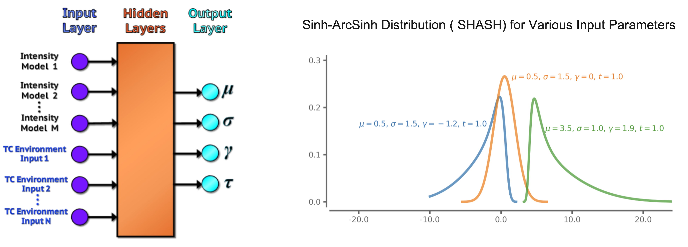
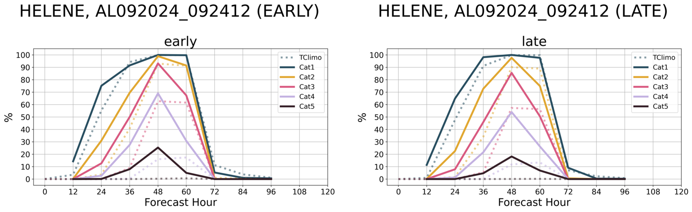
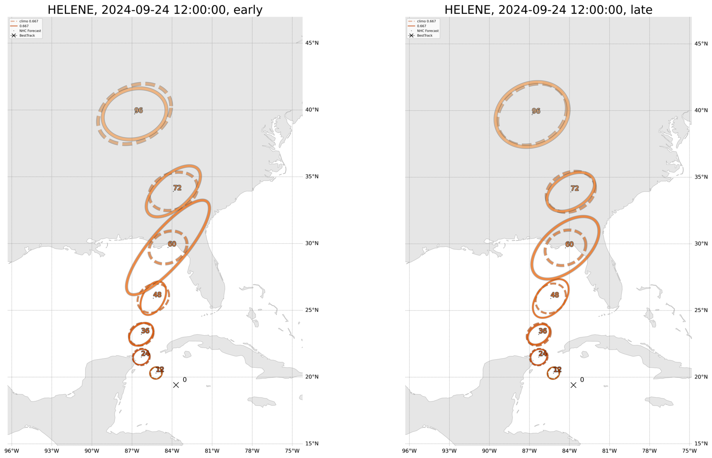
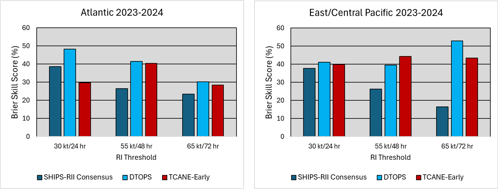

# tcane_plot

This repository contains the real-time visualization code for the Tropical Cyclone Artificial Neural-network Error model (TCANE). After you have cloned this repo using `git clone`, navigate to the correct directory (`tcane_plot`). 
1. Set up the environment file using `conda`: `conda env create -f environment.yml` (note that creating the environment might take a few minutes; don't panic!). This is the same environment as the `tcane_intensity` and `tcane_track` code used to run the TCANE model (see Martin Fernandez's [intensity](https://github.com/mafern/tcane_intensity) and [track](https://github.com/mafern/tcane_track) repos for the most up-to-date version of TCANE).
2. To activate environment, run `conda activate env-hurr-tfp`. To deactivate, the command is `conda deactivate`.
	* Double check your versions of `cartopy` and `shapely` by using `conda list cartopy` and `conda list shapely`. `cartopy` should be version 0.21.0 and `shapely` should be version 1.8.2. If needed, reinstall the correct versions of these packages (e.g., `pip install cartopy==0.21.0`).
	* Double check that `matplotlib` is version 3.7.x (`conda list matplotlib`). 
	* Finally, downgrade `protobuf` to 3.19.x. We recommend 3.19.6 (e.g., `pip install protobuf==3.19.6`)
3. Run the setup script to create appropriate directories: `python setup.py`
4. The plotting code can only run if you have already created realtime TCANE input files and output files (and TCANE climatology). The plotting code can be run from the command line with the following inputs: `python run_plotting_code.py STORMDATE INPUT_DIR OUTPUT_DIR BDECK_DIR`
  * `STORMDATE` contains the date and location of the storm to plot. It should have the format `BBNNYYYY_MMDDHH`, where `BB` is the 2-letter basin abbreviation and `NN` is the 2 character storm number.
  * `INPUT_DIR` is the directory where the TCANE input files are located.
  * `OUTPUT_DIR` is the directory where the TCANE output files are located.
  * `BDECK_DIR` is the directory where bdeck and edeck information is located.
5. Figures will be saved in `Figures/DATE/`, in both PNG and PDF format. Log files will also be written. From here, the images can be posted to real-time forecasting webpages, such as CIRA's tc-realtime.
6. Some examples of our visual evaluation tools:
 **Figure 1**. Probability of Hurricane Helene reaching Category 1, 2, 3, 4, and 5 strength for forecasts issued on 09-24-2024 12Z.
 **Figure 2**. Track error forecasts for Hurricane Helen issued on 09-24-2024 12Z. Solid orange lines indicate the TCANE error forecasts for the 66.67%-ile, while dashed lines indicate the climatological forecasts at the 66.67%-ile. The 66.67%-ile is chosen to best match the existing National Hurricane Center forecast uncertainty. 
 **Figure 3**. Skill of TCANE rapid intensification predictions versus other statistical models.

Stay tuned! TCANE will be running in real time on the CIRA TC Realtime webpage for the 2025 tropical cyclone season! 

